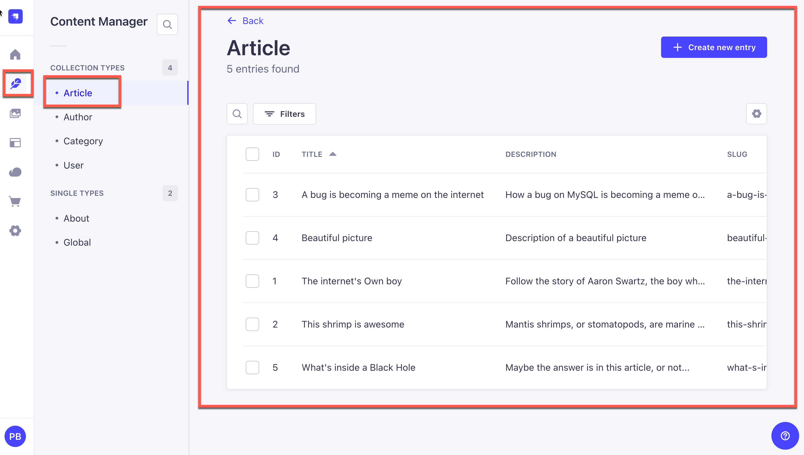
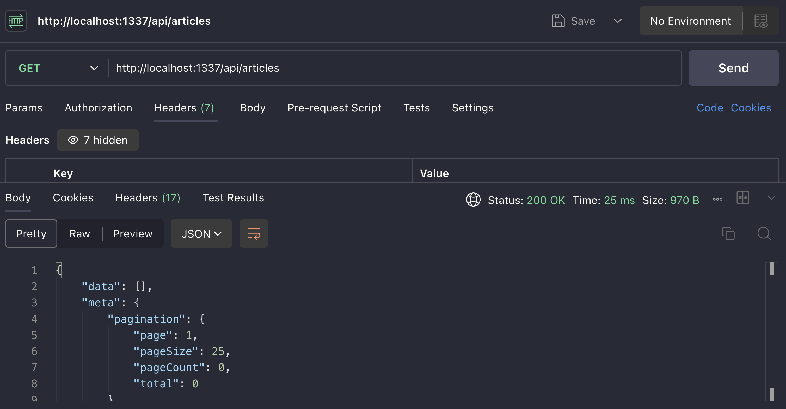
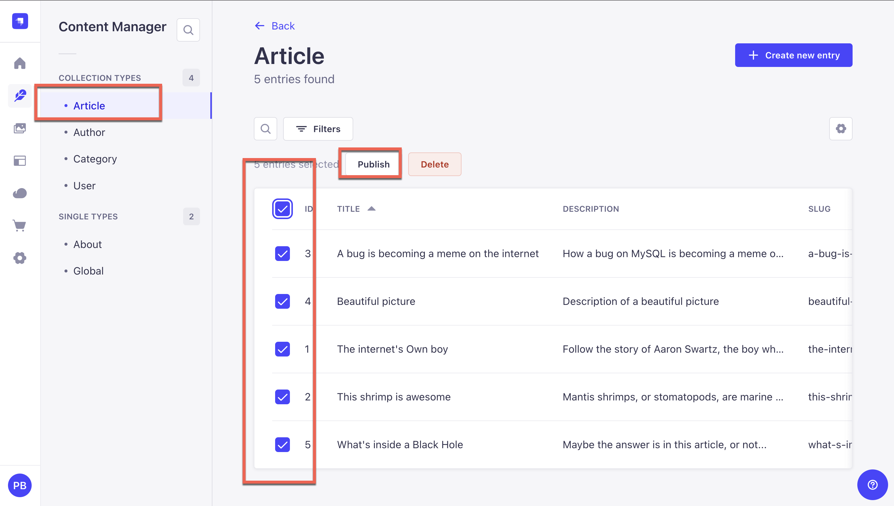
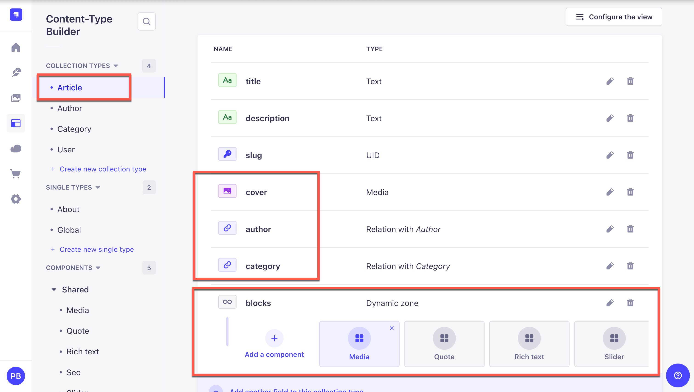
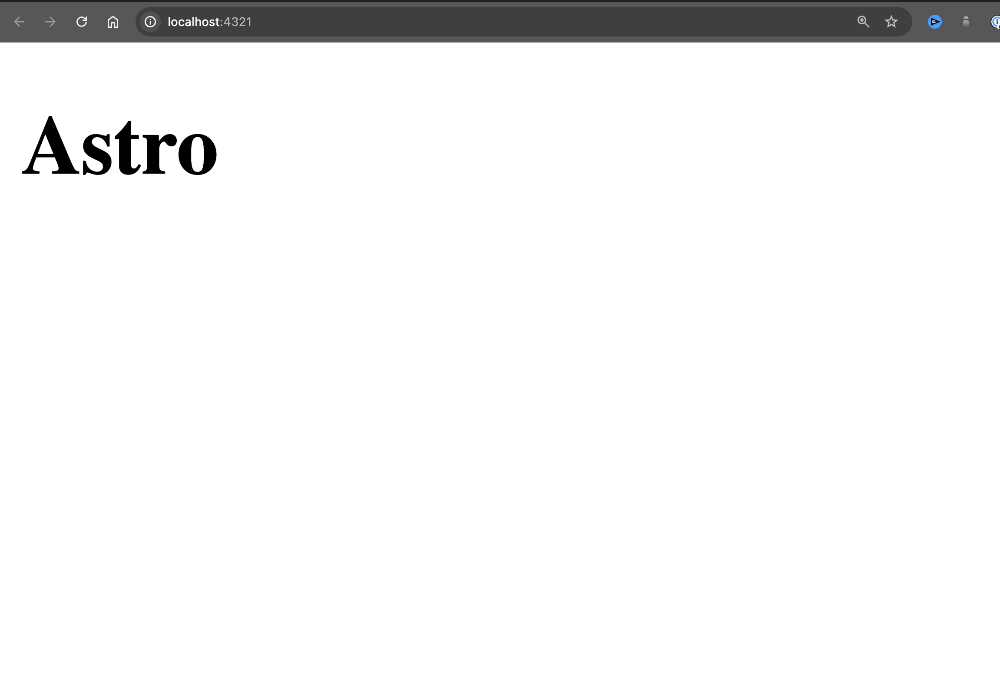
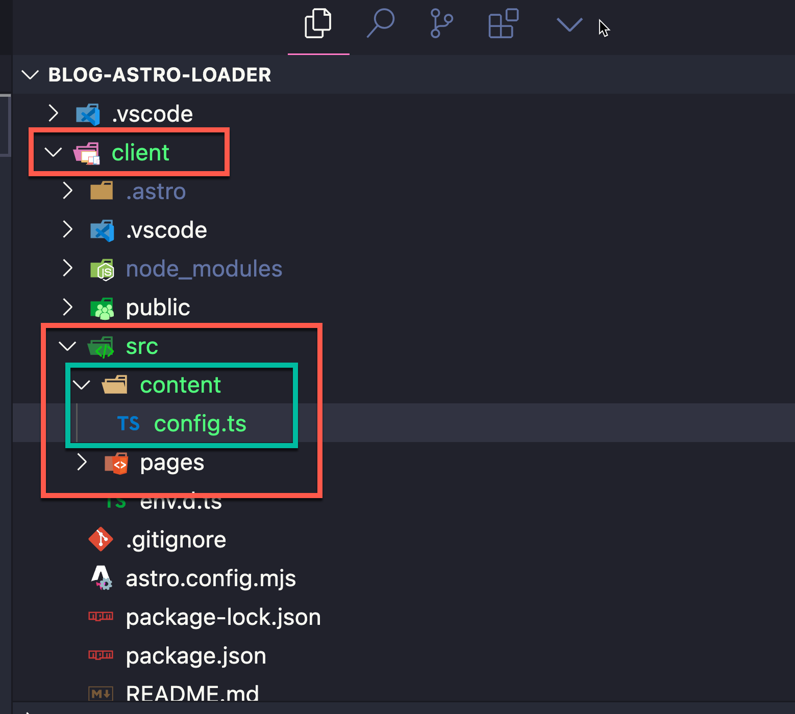
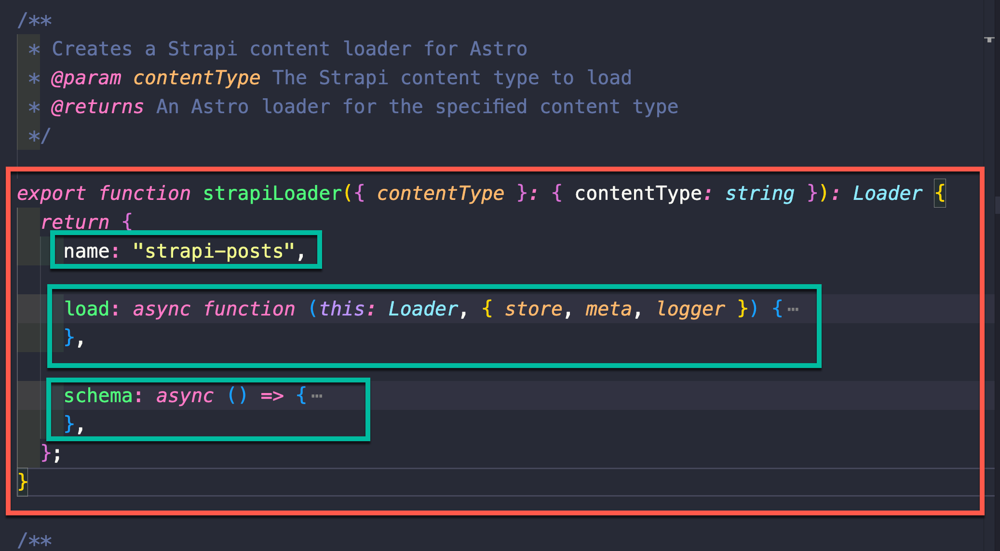

# How to create a custom Astro Loader for Strapi using Content Layer API

In this blog post, we will learn how to create a custom Astro Loader for Strapi using Content Layer API.

## What is Content Layer API?

In Astro we are able to use Content Layer API to reference our project's data.

Which makes it easier to work with local content (Markdown, MDX,JSON, etc.) in Astro.

But in the past it was only limited to local files.

You can read more about it [here](https://docs.astro.build/en/guides/content-collections)

But with the new recent update, we are now able to use it to create custom loaders to fetch data from any API.

Which is what we will be doing in this blog post.

We will be creating a custom loader to fetch data from Strapi API.

## What is Strapi?

Strapi is a headless CMS that allows us to create custom APIs.

We will be using Strapi 5 to manage our content that we can access via an API that will be used by our custom Astro Loader to fetch our data.

Let's take a look at how we can accomplish this.

Here is the repo for this blog post: [Strapi + Astro](https://github.com/PunGrumpy/strapi-astro-custom-loader)

It includes the completed code for you to try, but in this post we will go through the important parts, building our custom loader and fetching our data from Strapi.

## Setting up our Strapi project

To get started, create a new folder for our project and initialize a new Strapi project with the following command:

```bash
npx create-strapi-app@rc server
```

We are using the latest Strapi 5 release candidate at the time of writing this post.

After release, (September 23rd 2024) you will be able to install Strapi 5 with the following command:

```bash
npx create-strapi-app@latest server
```

You will be prompted with a few questions:

```bash

? Please log in or sign up. Skip
? Do you want to use the default database (sqlite) ? Yes
? Start with an example structure & data? Yes
? Start with Typescript? Yes
? Install dependencies with npm? Yes
? Initialize a git repository? Yes
```

We will be using the default database (sqlite) and select `yes` for example structure & data.

This will create a new Strapi project with content and collection types for us to work with.

Once Strapi is installed, change directory into the `server` folder and start Strapi with the following command:

```bash
  yarn develop
```

This will start our Strapi server on port 1337.

You will be greeted with the Strapi welcome screen.


Go ahead and create your first Strapi Admin User.

Once done, you will be redirected to the Strapi dashboard.


Navigate to the Strapi's **Content Manager** for the `Articles` collection type.

You should see the following article that were created for us.



Now that we have our **Articles** setup, let's enable the API on our **Articles** collection type. To allow us to fetch our data from our API.

You can do so in Settings -> Users & Permissions Plugin -> Roles -> Public

By default, the **Public** role will have the **Find** action enabled for all collection types.

This was enable for us when we created our project and said `yes` to include example data.


If you tried to make an API request to fetch our articles and don't see the data, make sure that you have published your articles.



Navigate to the **Articles** collection type and select all the articles and publish them.




Now if you make a request to `http://localhost:1337/api/articles` you should see the following response.

```json
{
  "data": [
    {
      "id": 6,
      "documentId": "u93xyi2h6hy8axyid416wgzs",
      "title": "A bug is becoming a meme on the internet",
      "description": "How a bug on MySQL is becoming a meme on the internet",
      "slug": "a-bug-is-becoming-a-meme-on-the-internet",
      "createdAt": "2024-09-18T12:38:13.369Z",
      "updatedAt": "2024-09-18T12:38:13.369Z",
      "publishedAt": "2024-09-18T12:55:54.535Z",
      "locale": null
    },
    {
      "id": 7,
      "documentId": "tpxdu1lmktawx78i9c0pak3b",
      "title": "Beautiful picture",
      "description": "Description of a beautiful picture",
      "slug": "beautiful-picture",
      "createdAt": "2024-09-18T12:38:13.556Z",
      "updatedAt": "2024-09-18T12:38:13.556Z",
      "publishedAt": "2024-09-18T12:55:54.535Z",
      "locale": null
    },
    {
      "id": 8,
      "documentId": "v6b829wo4k0jfitfpzevl5tx",
      "title": "The internet's Own boy",
      "description": "Follow the story of Aaron Swartz, the boy who could change the world",
      "slug": "the-internet-s-own-boy",
      "createdAt": "2024-09-18T12:38:13.161Z",
      "updatedAt": "2024-09-18T12:38:13.161Z",
      "publishedAt": "2024-09-18T12:55:54.535Z",
      "locale": null
    },
    {
      "id": 9,
      "documentId": "k1uos9ptvchyqnhaze4k3pgt",
      "title": "This shrimp is awesome",
      "description": "Mantis shrimps, or stomatopods, are marine crustaceans of the order Stomatopoda.",
      "slug": "this-shrimp-is-awesome",
      "createdAt": "2024-09-18T12:38:13.215Z",
      "updatedAt": "2024-09-18T12:38:13.215Z",
      "publishedAt": "2024-09-18T12:55:54.535Z",
      "locale": null
    },
    {
      "id": 10,
      "documentId": "nu2qbzm7bocsvy28s175qf73",
      "title": "What's inside a Black Hole",
      "description": "Maybe the answer is in this article, or not...",
      "slug": "what-s-inside-a-black-hole",
      "createdAt": "2024-09-18T12:38:13.596Z",
      "updatedAt": "2024-09-18T12:38:13.596Z",
      "publishedAt": "2024-09-18T12:55:54.535Z",
      "locale": null
    }
  ],
  "meta": {
    "pagination": {
      "page": 1,
      "pageSize": 25,
      "pageCount": 1,
      "total": 5
    }
  }
}
```

We are not getting all of our data, which is expected, to prevent over fetching data from our API we need to tell Strapi specifically what items we would like to fetch.

For instance if you take a look at our post you will notice that we have `cover` image, `author` and `category` relations and `blocks` dynamic zone.



You can learn more about Strapi's populate and filtering here:
[Demystifying Strapi's Populate & Filtering](https://strapi.io/blog/demystifying-strapi-s-populate-and-filtering)

And how you can set up default populate for your collection types via middleware here:
[Route-Based Middleware to Handle Default Population Query Logic](https://strapi.io/blog/route-based-middleware-to-handle-default-population-query-logic)

We will set up default populate via **middleware** for this example, which will be a great learning opportunity for us.

And is a more secure way to prevent users from fetching any extra data that they don't need.

## Setting up our custom middleware to populate our articles data

In Strapi, we have access to CLI that will allow us to generate a middleware.

To do so, run the following command in the root of our Strapi project:

```bash
npx strapi generate
```

You will be prompted with a few questions:

```bash
➜  server git:(main) ✗ npx strapi generate
? Strapi Generators middleware - Generate a middleware for an API
? Middleware name populate-article
? Where do you want to add this middleware? Add middleware to an existing API
? Which API is this for? article
✔  ++ /api/article/middlewares/populate-article.ts

```

We will be adding our middleware to the `article` API.

This will create a new file in `api/article/middlewares/populate-article.ts`.

Let's open the file and add the following code:

```typescript
/**
 * `populate-article` middleware
 */

const populate = {
  populate: {
    cover: {
      fields: ["url", "alternativeText", "name", "width", "height"],
    },
    blocks: {
      on: {
        "shared.media": {
          populate: {
            file: {
              fields: ["url", "alternativeText", "name", "width", "height"],
            },
          },
        },

        "shared.slider": {
          populate: {
            files: {
              fields: ["url", "alternativeText", "name", "width", "height"],
            },
          },
        },

        "shared.quote": {
          populate: true,
        },

        "shared.rich-text": {
          populate: true,
        },
      },
    },
  },
};

import type { Core } from "@strapi/strapi";

export default (config, { strapi }: { strapi: Core.Strapi }) => {
  console.log("populate-article middleware");
  // Add your own logic here.
  return async (ctx, next) => {
    ctx.query = {
      ...ctx.query,
      ...populate,
    };
    strapi.log.info("In populate-article middleware.");

    await next();
  };
};
```

In the code above, we are defining a populate object that will be used to populate our articles data.

We are using the `populate` property to tell Strapi to populate our articles data with the following options:

- `cover`: Populate the `cover` relation with the following fields: `url`, `alternativeText`, `name`, `width`, `height`.
- `blocks`: Populate the `blocks` relation with the following options:
  - `on`: Populate the `blocks` relation with the following options:
    - `shared.media`: Populate the `shared.media` relation with the following fields: `url`, `alternativeText`, `name`, `width`, `height`.
    - `shared.slider`: Populate the `shared.slider` relation with the following fields: `url`, `alternativeText`, `name`, `width`, `height`.
    - `shared.quote`: Populate the `shared.quote` relation with the following fields: `url`, `alternativeText`, `name`, `width`, `height`.

Now, that we have our middleware setup, we will need to reference it in our API route.

To do so, open `api/article/routes/article.ts` and add the following code:

```typescript
/**
 * article router.
 */

import { factories } from "@strapi/strapi";

export default factories.createCoreRouter("api::article.article", {
  config: {
    find: {
      middlewares: ["api::article.populate-article"],
    },
    findOne: {
      middlewares: ["api::article.populate-article"],
    },
  },
});
```

Now that we have our middleware and our route setup, we can start our Strapi server and make a request to our API to fetch our articles.

```bash
yarn develop
```

You can make a request to `http://localhost:1337/api/articles` to fetch our articles.

You should see the following response:

```json
{
  "data": [
    {
      "id": 6,
      "documentId": "u93xyi2h6hy8axyid416wgzs",
      "title": "A bug is becoming a meme on the internet",
      "description": "How a bug on MySQL is becoming a meme on the internet",
      "slug": "a-bug-is-becoming-a-meme-on-the-internet",
      "createdAt": "2024-09-18T12:38:13.369Z",
      "updatedAt": "2024-09-18T12:38:13.369Z",
      "publishedAt": "2024-09-18T12:55:54.535Z",
      "locale": null,
      "cover": {
        "id": 7,
        "documentId": "sipkbxby7bn82supbvuxe9ms",
        "url": "/uploads/a_bug_is_becoming_a_meme_on_the_internet_f4e50f5260.jpeg",
        "alternativeText": "An image uploaded to Strapi called a-bug-is-becoming-a-meme-on-the-internet",
        "name": "a-bug-is-becoming-a-meme-on-the-internet",
        "width": 3628,
        "height": 2419
      },
      "blocks": [
        {
          "__component": "shared.rich-text",
          "id": 12,
          "body": "## Probant \n\nse Lorem markdownum negat. Argo *saxa* videnda cornuaque hunc qui tanta spes teneas! Obliquis est dicenti est salutat ille tamen iuvenum nostrae dolore. - Colores nocituraque comitata eripiunt - Addit quodcunque solum cui et dextram illis - Nulli meus nec extemplo ille ferebat pressit Se blandita fulvae vox gravem Pittheus cesserunt sanguine herbis tu comitum tenuit. Sui in ruunt; Doridaque maculosae fuissem! Et loqui. \n\n## Abit sua\n\nse Lorem markdownum negat. Argo *saxa* videnda cornuaque hunc qui tanta spes teneas! Obliquis est dicenti est salutat ille tamen iuvenum nostrae dolore. - Colores nocituraque comitata eripiunt - Addit quodcunque solum cui et dextram illis - Nulli meus nec extemplo ille ferebat pressit Se blandita fulvae vox gravem Pittheus cesserunt sanguine herbis tu comitum tenuit. Sui in ruunt; Doridaque maculosae fuissem! Et loqui. "
        },
        {
          "__component": "shared.quote",
          "id": 7,
          "title": "Thelonius Monk",
          "body": "You've got to dig it to dig it, you dig?"
        },
        {
          "__component": "shared.media",
          "id": 7,
          "file": {
            "id": 4,
            "documentId": "ql3knuf4jpvy7f1dwki6rfj1",
            "url": "/uploads/coffee_art_e195daffa4.jpeg",
            "alternativeText": "An image uploaded to Strapi called coffee-art",
            "name": "coffee-art",
            "width": 5824,
            "height": 3259
          }
        },
        {
          "__component": "shared.rich-text",
          "id": 13,
          "body": "## Spatiantia astra \n\nFoeda, medio silva *errandum*: onus formam munere. Mutata bibulis est auxiliare arces etiamnunc verbis virgineo Priamidas illa Thescelus, nam fit locis lucis auras. Exitus hospes gratulor ut pondere [speslimite](http://www.curas.io/figuram); quid habent, Avernales faciente de. Pervenit Ino sonabile supplex cognoscenti vires, Bacchumque errat miserarum venandi dignabere dedisti. Discrimina iuncosaque virgaque tot sine superest [fissus](http://quos.org/sitet.aspx). Non color esset potest non sumit, sed vix arserat. Nisi immo silva tantum pectusque quos pennis quisquam artus!"
        },
        {
          "__component": "shared.slider",
          "id": 6,
          "files": [
            {
              "id": 4,
              "documentId": "ql3knuf4jpvy7f1dwki6rfj1",
              "url": "/uploads/coffee_art_e195daffa4.jpeg",
              "alternativeText": "An image uploaded to Strapi called coffee-art",
              "name": "coffee-art",
              "width": 5824,
              "height": 3259
            },
            {
              "id": 5,
              "documentId": "jbal0z30dzdz1r430z397lv0",
              "url": "/uploads/coffee_beans_40fe668559.jpeg",
              "alternativeText": "An image uploaded to Strapi called coffee-beans",
              "name": "coffee-beans",
              "width": 5021,
              "height": 3347
            }
          ]
        }
      ]
    },
    {
      "id": 7,
      "documentId": "tpxdu1lmktawx78i9c0pak3b",
      "title": "Beautiful picture",
      "description": "Description of a beautiful picture",
      "slug": "beautiful-picture",
      "createdAt": "2024-09-18T12:38:13.556Z",
      "updatedAt": "2024-09-18T12:38:13.556Z",
      "publishedAt": "2024-09-18T12:55:54.535Z",
      "locale": null,
      "cover": {
        "id": 8,
        "documentId": "qxfy8ecrp9qn6hn4cj3jli6e",
        "url": "/uploads/beautiful_picture_c01396b54b.jpeg",
        "alternativeText": "An image uploaded to Strapi called beautiful-picture",
        "name": "beautiful-picture",
        "width": 3824,
        "height": 2548
      },
      "blocks": [
        {
          "__component": "shared.rich-text",
          "id": 14,
          "body": "## Probant \n\nse Lorem markdownum negat. Argo *saxa* videnda cornuaque hunc qui tanta spes teneas! Obliquis est dicenti est salutat ille tamen iuvenum nostrae dolore. - Colores nocituraque comitata eripiunt - Addit quodcunque solum cui et dextram illis - Nulli meus nec extemplo ille ferebat pressit Se blandita fulvae vox gravem Pittheus cesserunt sanguine herbis tu comitum tenuit. Sui in ruunt; Doridaque maculosae fuissem! Et loqui. \n\n## Abit sua\n\nse Lorem markdownum negat. Argo *saxa* videnda cornuaque hunc qui tanta spes teneas! Obliquis est dicenti est salutat ille tamen iuvenum nostrae dolore. - Colores nocituraque comitata eripiunt - Addit quodcunque solum cui et dextram illis - Nulli meus nec extemplo ille ferebat pressit Se blandita fulvae vox gravem Pittheus cesserunt sanguine herbis tu comitum tenuit. Sui in ruunt; Doridaque maculosae fuissem! Et loqui. "
        },
        {
          "__component": "shared.quote",
          "id": 8,
          "title": "Thelonius Monk",
          "body": "You've got to dig it to dig it, you dig?"
        },
        {
          "__component": "shared.media",
          "id": 8,
          "file": {
            "id": 4,
            "documentId": "ql3knuf4jpvy7f1dwki6rfj1",
            "url": "/uploads/coffee_art_e195daffa4.jpeg",
            "alternativeText": "An image uploaded to Strapi called coffee-art",
            "name": "coffee-art",
            "width": 5824,
            "height": 3259
          }
        },
        {
          "__component": "shared.rich-text",
          "id": 15,
          "body": "## Spatiantia astra \n\nFoeda, medio silva *errandum*: onus formam munere. Mutata bibulis est auxiliare arces etiamnunc verbis virgineo Priamidas illa Thescelus, nam fit locis lucis auras. Exitus hospes gratulor ut pondere [speslimite](http://www.curas.io/figuram); quid habent, Avernales faciente de. Pervenit Ino sonabile supplex cognoscenti vires, Bacchumque errat miserarum venandi dignabere dedisti. Discrimina iuncosaque virgaque tot sine superest [fissus](http://quos.org/sitet.aspx). Non color esset potest non sumit, sed vix arserat. Nisi immo silva tantum pectusque quos pennis quisquam artus!"
        },
        {
          "__component": "shared.slider",
          "id": 7,
          "files": [
            {
              "id": 4,
              "documentId": "ql3knuf4jpvy7f1dwki6rfj1",
              "url": "/uploads/coffee_art_e195daffa4.jpeg",
              "alternativeText": "An image uploaded to Strapi called coffee-art",
              "name": "coffee-art",
              "width": 5824,
              "height": 3259
            },
            {
              "id": 5,
              "documentId": "jbal0z30dzdz1r430z397lv0",
              "url": "/uploads/coffee_beans_40fe668559.jpeg",
              "alternativeText": "An image uploaded to Strapi called coffee-beans",
              "name": "coffee-beans",
              "width": 5021,
              "height": 3347
            }
          ]
        }
      ]
    },
    {
      "id": 8,
      "documentId": "v6b829wo4k0jfitfpzevl5tx",
      "title": "The internet's Own boy",
      "description": "Follow the story of Aaron Swartz, the boy who could change the world",
      "slug": "the-internet-s-own-boy",
      "createdAt": "2024-09-18T12:38:13.161Z",
      "updatedAt": "2024-09-18T12:38:13.161Z",
      "publishedAt": "2024-09-18T12:55:54.535Z",
      "locale": null,
      "cover": {
        "id": 3,
        "documentId": "vi863t425htqu69292k7bgr3",
        "url": "/uploads/the_internet_s_own_boy_35bc7356b4.jpeg",
        "alternativeText": "An image uploaded to Strapi called the-internet-s-own-boy",
        "name": "the-internet-s-own-boy",
        "width": 1200,
        "height": 707
      },
      "blocks": [
        {
          "__component": "shared.rich-text",
          "id": 16,
          "body": "## Probant \n\nse Lorem markdownum negat. Argo *saxa* videnda cornuaque hunc qui tanta spes teneas! Obliquis est dicenti est salutat ille tamen iuvenum nostrae dolore. - Colores nocituraque comitata eripiunt - Addit quodcunque solum cui et dextram illis - Nulli meus nec extemplo ille ferebat pressit Se blandita fulvae vox gravem Pittheus cesserunt sanguine herbis tu comitum tenuit. Sui in ruunt; Doridaque maculosae fuissem! Et loqui. \n\n## Abit sua\n\nse Lorem markdownum negat. Argo *saxa* videnda cornuaque hunc qui tanta spes teneas! Obliquis est dicenti est salutat ille tamen iuvenum nostrae dolore. - Colores nocituraque comitata eripiunt - Addit quodcunque solum cui et dextram illis - Nulli meus nec extemplo ille ferebat pressit Se blandita fulvae vox gravem Pittheus cesserunt sanguine herbis tu comitum tenuit. Sui in ruunt; Doridaque maculosae fuissem! Et loqui. "
        },
        {
          "__component": "shared.quote",
          "id": 9,
          "title": "Thelonius Monk",
          "body": "You've got to dig it to dig it, you dig?"
        },
        {
          "__component": "shared.media",
          "id": 9,
          "file": {
            "id": 4,
            "documentId": "ql3knuf4jpvy7f1dwki6rfj1",
            "url": "/uploads/coffee_art_e195daffa4.jpeg",
            "alternativeText": "An image uploaded to Strapi called coffee-art",
            "name": "coffee-art",
            "width": 5824,
            "height": 3259
          }
        },
        {
          "__component": "shared.rich-text",
          "id": 17,
          "body": "## Spatiantia astra \n\nFoeda, medio silva *errandum*: onus formam munere. Mutata bibulis est auxiliare arces etiamnunc verbis virgineo Priamidas illa Thescelus, nam fit locis lucis auras. Exitus hospes gratulor ut pondere [speslimite](http://www.curas.io/figuram); quid habent, Avernales faciente de. Pervenit Ino sonabile supplex cognoscenti vires, Bacchumque errat miserarum venandi dignabere dedisti. Discrimina iuncosaque virgaque tot sine superest [fissus](http://quos.org/sitet.aspx). Non color esset potest non sumit, sed vix arserat. Nisi immo silva tantum pectusque quos pennis quisquam artus!"
        },
        {
          "__component": "shared.slider",
          "id": 8,
          "files": [
            {
              "id": 4,
              "documentId": "ql3knuf4jpvy7f1dwki6rfj1",
              "url": "/uploads/coffee_art_e195daffa4.jpeg",
              "alternativeText": "An image uploaded to Strapi called coffee-art",
              "name": "coffee-art",
              "width": 5824,
              "height": 3259
            },
            {
              "id": 5,
              "documentId": "jbal0z30dzdz1r430z397lv0",
              "url": "/uploads/coffee_beans_40fe668559.jpeg",
              "alternativeText": "An image uploaded to Strapi called coffee-beans",
              "name": "coffee-beans",
              "width": 5021,
              "height": 3347
            }
          ]
        }
      ]
    },
    {
      "id": 9,
      "documentId": "k1uos9ptvchyqnhaze4k3pgt",
      "title": "This shrimp is awesome",
      "description": "Mantis shrimps, or stomatopods, are marine crustaceans of the order Stomatopoda.",
      "slug": "this-shrimp-is-awesome",
      "createdAt": "2024-09-18T12:38:13.215Z",
      "updatedAt": "2024-09-18T12:38:13.215Z",
      "publishedAt": "2024-09-18T12:55:54.535Z",
      "locale": null,
      "cover": {
        "id": 6,
        "documentId": "zbwb0no52euzikfwek2mogy0",
        "url": "/uploads/this_shrimp_is_awesome_f1e228f3fb.jpeg",
        "alternativeText": "An image uploaded to Strapi called this-shrimp-is-awesome",
        "name": "this-shrimp-is-awesome",
        "width": 1200,
        "height": 630
      },
      "blocks": [
        {
          "__component": "shared.rich-text",
          "id": 18,
          "body": "## Probant \n\nse Lorem markdownum negat. Argo *saxa* videnda cornuaque hunc qui tanta spes teneas! Obliquis est dicenti est salutat ille tamen iuvenum nostrae dolore. - Colores nocituraque comitata eripiunt - Addit quodcunque solum cui et dextram illis - Nulli meus nec extemplo ille ferebat pressit Se blandita fulvae vox gravem Pittheus cesserunt sanguine herbis tu comitum tenuit. Sui in ruunt; Doridaque maculosae fuissem! Et loqui. \n\n## Abit sua\n\nse Lorem markdownum negat. Argo *saxa* videnda cornuaque hunc qui tanta spes teneas! Obliquis est dicenti est salutat ille tamen iuvenum nostrae dolore. - Colores nocituraque comitata eripiunt - Addit quodcunque solum cui et dextram illis - Nulli meus nec extemplo ille ferebat pressit Se blandita fulvae vox gravem Pittheus cesserunt sanguine herbis tu comitum tenuit. Sui in ruunt; Doridaque maculosae fuissem! Et loqui. "
        },
        {
          "__component": "shared.quote",
          "id": 10,
          "title": "Thelonius Monk",
          "body": "You've got to dig it to dig it, you dig?"
        },
        {
          "__component": "shared.media",
          "id": 10,
          "file": {
            "id": 4,
            "documentId": "ql3knuf4jpvy7f1dwki6rfj1",
            "url": "/uploads/coffee_art_e195daffa4.jpeg",
            "alternativeText": "An image uploaded to Strapi called coffee-art",
            "name": "coffee-art",
            "width": 5824,
            "height": 3259
          }
        },
        {
          "__component": "shared.rich-text",
          "id": 19,
          "body": "## Spatiantia astra \n\nFoeda, medio silva *errandum*: onus formam munere. Mutata bibulis est auxiliare arces etiamnunc verbis virgineo Priamidas illa Thescelus, nam fit locis lucis auras. Exitus hospes gratulor ut pondere [speslimite](http://www.curas.io/figuram); quid habent, Avernales faciente de. Pervenit Ino sonabile supplex cognoscenti vires, Bacchumque errat miserarum venandi dignabere dedisti. Discrimina iuncosaque virgaque tot sine superest [fissus](http://quos.org/sitet.aspx). Non color esset potest non sumit, sed vix arserat. Nisi immo silva tantum pectusque quos pennis quisquam artus!"
        },
        {
          "__component": "shared.slider",
          "id": 9,
          "files": [
            {
              "id": 4,
              "documentId": "ql3knuf4jpvy7f1dwki6rfj1",
              "url": "/uploads/coffee_art_e195daffa4.jpeg",
              "alternativeText": "An image uploaded to Strapi called coffee-art",
              "name": "coffee-art",
              "width": 5824,
              "height": 3259
            },
            {
              "id": 5,
              "documentId": "jbal0z30dzdz1r430z397lv0",
              "url": "/uploads/coffee_beans_40fe668559.jpeg",
              "alternativeText": "An image uploaded to Strapi called coffee-beans",
              "name": "coffee-beans",
              "width": 5021,
              "height": 3347
            }
          ]
        }
      ]
    },
    {
      "id": 10,
      "documentId": "nu2qbzm7bocsvy28s175qf73",
      "title": "What's inside a Black Hole",
      "description": "Maybe the answer is in this article, or not...",
      "slug": "what-s-inside-a-black-hole",
      "createdAt": "2024-09-18T12:38:13.596Z",
      "updatedAt": "2024-09-18T12:38:13.596Z",
      "publishedAt": "2024-09-18T12:55:54.535Z",
      "locale": null,
      "cover": {
        "id": 9,
        "documentId": "o40rnm9dss25bk1p8ybg43oh",
        "url": "/uploads/what_s_inside_a_black_hole_5415177b52.jpeg",
        "alternativeText": "An image uploaded to Strapi called what-s-inside-a-black-hole",
        "name": "what-s-inside-a-black-hole",
        "width": 800,
        "height": 466
      },
      "blocks": [
        {
          "__component": "shared.rich-text",
          "id": 20,
          "body": "## Probant \n\nse Lorem markdownum negat. Argo *saxa* videnda cornuaque hunc qui tanta spes teneas! Obliquis est dicenti est salutat ille tamen iuvenum nostrae dolore. - Colores nocituraque comitata eripiunt - Addit quodcunque solum cui et dextram illis - Nulli meus nec extemplo ille ferebat pressit Se blandita fulvae vox gravem Pittheus cesserunt sanguine herbis tu comitum tenuit. Sui in ruunt; Doridaque maculosae fuissem! Et loqui. \n\n## Abit sua\n\nse Lorem markdownum negat. Argo *saxa* videnda cornuaque hunc qui tanta spes teneas! Obliquis est dicenti est salutat ille tamen iuvenum nostrae dolore. - Colores nocituraque comitata eripiunt - Addit quodcunque solum cui et dextram illis - Nulli meus nec extemplo ille ferebat pressit Se blandita fulvae vox gravem Pittheus cesserunt sanguine herbis tu comitum tenuit. Sui in ruunt; Doridaque maculosae fuissem! Et loqui. "
        },
        {
          "__component": "shared.quote",
          "id": 11,
          "title": "Thelonius Monk",
          "body": "You've got to dig it to dig it, you dig?"
        },
        {
          "__component": "shared.media",
          "id": 11,
          "file": {
            "id": 4,
            "documentId": "ql3knuf4jpvy7f1dwki6rfj1",
            "url": "/uploads/coffee_art_e195daffa4.jpeg",
            "alternativeText": "An image uploaded to Strapi called coffee-art",
            "name": "coffee-art",
            "width": 5824,
            "height": 3259
          }
        },
        {
          "__component": "shared.rich-text",
          "id": 21,
          "body": "## Spatiantia astra \n\nFoeda, medio silva *errandum*: onus formam munere. Mutata bibulis est auxiliare arces etiamnunc verbis virgineo Priamidas illa Thescelus, nam fit locis lucis auras. Exitus hospes gratulor ut pondere [speslimite](http://www.curas.io/figuram); quid habent, Avernales faciente de. Pervenit Ino sonabile supplex cognoscenti vires, Bacchumque errat miserarum venandi dignabere dedisti. Discrimina iuncosaque virgaque tot sine superest [fissus](http://quos.org/sitet.aspx). Non color esset potest non sumit, sed vix arserat. Nisi immo silva tantum pectusque quos pennis quisquam artus!"
        },
        {
          "__component": "shared.slider",
          "id": 10,
          "files": [
            {
              "id": 4,
              "documentId": "ql3knuf4jpvy7f1dwki6rfj1",
              "url": "/uploads/coffee_art_e195daffa4.jpeg",
              "alternativeText": "An image uploaded to Strapi called coffee-art",
              "name": "coffee-art",
              "width": 5824,
              "height": 3259
            },
            {
              "id": 5,
              "documentId": "jbal0z30dzdz1r430z397lv0",
              "url": "/uploads/coffee_beans_40fe668559.jpeg",
              "alternativeText": "An image uploaded to Strapi called coffee-beans",
              "name": "coffee-beans",
              "width": 5021,
              "height": 3347
            }
          ]
        }
      ]
    }
  ],
  "meta": {
    "pagination": {
      "page": 1,
      "pageSize": 25,
      "pageCount": 1,
      "total": 5
    }
  }
}
```

Nice, now that we have our articles data, and before we set up our Astro project, we have one more thing to do.

When creating our **Astro Loader**, we would want it to infer the types from our Strapi API.

But at the moment, Strapi provide a SDK that allows us to do that. That is in the works, but not yet ready.

So we will have get the Strapi Schema via a plugin that I created. If you are interseted on how I did this, let me know in the comments.

But we will just install it via NPM.

## Setting Up Get Schema Plugin

We are going to install the following package:

```bash
  yarn add get-strapi-schema
```

Once we have it installed, we neet to navigate to our `config` folder and create a folder called `plugins` if it doesn't already exist. And add the following code to enable the plugin.

```ts
export default () => ({
  "get-strapi-schema": {
    enabled: true,
  },
});
```

Now restart Strapi and we should be able to get the schema. We can do this by navigating to the following URL in our browser witht the name of the collection type.

```
  http://localhost:1337/get-strapi-schema/schema/article
```

You should see a JSON response.

```json
{
  "kind": "collectionType",
  "collectionName": "articles",
  "info": {
    "singularName": "article",
    "pluralName": "articles",
    "displayName": "Article",
    "description": "Create your blog content"
  },
  "options": {
    "draftAndPublish": true
  },
  "pluginOptions": {},
  "attributes": {
    "title": {
      "type": "string"
    },
    "description": {
      "type": "text",
      "maxLength": 80
    },
    "slug": {
      "type": "uid",
      "targetField": "title"
    },
    "cover": {
      "type": "media",
      "multiple": false,
      "required": false,
      "allowedTypes": ["images", "files", "videos"]
    },
    "author": {
      "type": "relation",
      "relation": "manyToOne",
      "target": "api::author.author",
      "inversedBy": "articles"
    },
    "category": {
      "type": "relation",
      "relation": "manyToOne",
      "target": "api::category.category",
      "inversedBy": "articles"
    },
    "blocks": {
      "type": "dynamiczone",
      "components": [
        "shared.media",
        "shared.quote",
        "shared.rich-text",
        "shared.slider"
      ]
    },
    "createdAt": {
      "type": "datetime"
    },
    "updatedAt": {
      "type": "datetime"
    },
    "publishedAt": {
      "type": "datetime",
      "configurable": false,
      "writable": true,
      "visible": false
    },
    "createdBy": {
      "type": "relation",
      "relation": "oneToOne",
      "target": "admin::user",
      "configurable": false,
      "writable": false,
      "visible": false,
      "useJoinTable": false,
      "private": true
    },
    "updatedBy": {
      "type": "relation",
      "relation": "oneToOne",
      "target": "admin::user",
      "configurable": false,
      "writable": false,
      "visible": false,
      "useJoinTable": false,
      "private": true
    },
    "locale": {
      "writable": true,
      "private": false,
      "configurable": false,
      "visible": false,
      "type": "string"
    },
    "localizations": {
      "type": "relation",
      "relation": "oneToMany",
      "target": "api::article.article",
      "writable": false,
      "private": false,
      "configurable": false,
      "visible": false,
      "unstable_virtual": true,
      "joinColumn": {
        "name": "document_id",
        "referencedColumn": "document_id",
        "referencedTable": "articles"
      }
    }
  },
  "apiName": "article",
  "globalId": "Article",
  "uid": "api::article.article",
  "modelType": "contentType",
  "__schema__": {
    "collectionName": "articles",
    "info": {
      "singularName": "article",
      "pluralName": "articles",
      "displayName": "Article",
      "description": "Create your blog content"
    },
    "options": {
      "draftAndPublish": true
    },
    "pluginOptions": {},
    "attributes": {
      "title": {
        "type": "string"
      },
      "description": {
        "type": "text",
        "maxLength": 80
      },
      "slug": {
        "type": "uid",
        "targetField": "title"
      },
      "cover": {
        "type": "media",
        "multiple": false,
        "required": false,
        "allowedTypes": ["images", "files", "videos"]
      },
      "author": {
        "type": "relation",
        "relation": "manyToOne",
        "target": "api::author.author",
        "inversedBy": "articles"
      },
      "category": {
        "type": "relation",
        "relation": "manyToOne",
        "target": "api::category.category",
        "inversedBy": "articles"
      },
      "blocks": {
        "type": "dynamiczone",
        "components": [
          "shared.media",
          "shared.quote",
          "shared.rich-text",
          "shared.slider"
        ]
      }
    },
    "kind": "collectionType"
  },
  "modelName": "article",
  "actions": {},
  "lifecycles": {}
}
```

This is what our loader will use to generate the types.

Now that our Strapi project is setup, let's setup our Astro project.

## Setting up our Astro project

You can learn more about Astro here: [Astro](https://astro.build/) but I will walk you through the steps to get a basic project setup.

We will get started by installing Astro with the following command:

```bash
  npm create astro@latest
```

You will be asked a series of questions, here is what I chose:

```bash

  astro   Launch sequence initiated.

  dir   Where should we create your new project? ./client

  tmpl   How would you like to start your new project? Empty

  ts   Do you plan to write TypeScript? Yes / strict

  deps   Install dependencies? Yes

  git   Initialize a new git repository? Yes

```

Once the project is created, we can started by navigating to the project directory called `client` and running the following command `yarn dev` to start the dev server.

You should see the following screen when navigating to `http://localhost:4321/`



Nice, we are ready to build our Strapi Astro Loader.

## Building our Strapi Astro Loader

Inside our Astro project, let's naviagate to our `src` folder and create a new folder called `content` with a `config.ts` file.



Inside our `config.ts` file, we will add the following code:

```ts
import { defineCollection, z } from "astro:content";
import { strapiLoader } from "../strapi-loader";

// Define the Strapi posts collection
// This sets up a custom loader for Strapi content
const strapiPostsLoader = defineCollection({
  loader: strapiLoader({ contentType: "article" }),
});

// Export the collections to be used in Astro
export const collections = {
  strapiPostsLoader,
};

// TODO: Implement the strapiLoader function in @/strapi-loader
```

In the file we just created, we are importing our `strapi-loader` and defining a collection for our Strapi posts.

We have not implemented our `strapi-loader` yet, but we will do that in a bit.

But to recap so far, we are using the `defineCollection` function to define a collection for our Strapi posts.

We are passing our `strapiLoader` function the contentType of `article`.

This will allow us to fetch our Strapi data inside of our Astro components.

And finally we are exporting our collections to be used in Astro. Which we will do in a bit.

But first, in the `src` folder, let's create a new file called `strapi-loader.ts`.

And add the following code:

```ts
import { z } from "astro:content";
import type { Loader } from "astro/loaders";
import type { ZodTypeAny, ZodObject } from "zod";

// Configuration constants
const STRAPI_BASE_URL =
  import.meta.env.STRAPI_BASE_URL || "http://localhost:1337";
const SYNC_INTERVAL = 60 * 1000; // 1 minute in milliseconds

/**
 * Creates a Strapi content loader for Astro
 * @param contentType The Strapi content type to load
 * @returns An Astro loader for the specified content type
 */

export function strapiLoader({ contentType }: { contentType: string }): Loader {
  return {
    name: "strapi-posts",

    load: async function (this: Loader, { store, meta, logger }) {
      const lastSynced = meta.get("lastSynced");

      // Avoid frequent syncs
      if (lastSynced && Date.now() - Number(lastSynced) < SYNC_INTERVAL) {
        logger.info("Skipping Strapi sync");
        return;
      }

      logger.info("Fetching posts from Strapi");

      try {
        // Fetch and store the content
        const data = await fetchFromStrapi(`/api/${contentType}s`);
        const posts = data?.data;

        if (!posts || !Array.isArray(posts)) {
          throw new Error("Invalid data received from Strapi");
        }

        // Get the schema
        const schemaOrFn = this.schema;
        if (!schemaOrFn) {
          throw new Error("Schema is not defined");
        }
        const schema =
          typeof schemaOrFn === "function" ? await schemaOrFn() : schemaOrFn;
        if (!(schema instanceof z.ZodType)) {
          throw new Error("Invalid schema: expected a Zod schema");
        }

        type Post = z.infer<typeof schema>;

        store.clear();
        posts.forEach((post: Post) => store.set({ id: post.id, data: post }));

        meta.set("lastSynced", String(Date.now()));
      } catch (error) {
        logger.error(
          `Error loading Strapi content: ${(error as Error).message}`
        );
        throw error;
      }
    },

    schema: async () => {
      const data = await fetchFromStrapi(
        `/get-strapi-schema/schema/${contentType}`
      );
      if (!data?.attributes) {
        throw new Error("Invalid schema data received from Strapi");
      }
      return generateZodSchema(data.attributes);
    },
  };
}

/**
 * Maps Strapi field types to Zod schema types
 * @param type The Strapi field type
 * @param field The field configuration object
 * @returns A Zod schema corresponding to the Strapi field type
 */
function mapTypeToZodSchema(type: string, field: any): ZodTypeAny {
  const schemaMap: Record<string, () => ZodTypeAny> = {
    string: () => z.string(),
    uid: () => z.string(),
    media: () =>
      z.object({
        allowedTypes: z.array(z.enum(field.allowedTypes)),
        type: z.literal("media"),
        multiple: z.boolean(),
        url: z.string(),
        alternativeText: z.string().optional(),
        caption: z.string().optional(),
        width: z.number().optional(),
        height: z.number().optional(),
      }),
    richtext: () => z.string(),
    datetime: () => z.string().datetime(),
    relation: () =>
      z
        .object({
          relation: z.literal(field.relation),
          target: z.literal(field.target),
          configurable: z.boolean().optional(),
          writable: z.boolean().optional(),
          visible: z.boolean().optional(),
          useJoinTable: z.boolean().optional(),
          private: z.boolean().optional(),
        })
        .optional(),
    boolean: () => z.boolean(),
    number: () => z.number(),
    array: () => z.array(mapTypeToZodSchema(field.items.type, field.items)),
    object: () => {
      const shape: Record<string, ZodTypeAny> = {};
      for (const [key, value] of Object.entries(field.properties)) {
        if (typeof value === "object" && value !== null && "type" in value) {
          shape[key] = mapTypeToZodSchema(value.type as string, value);
        } else {
          throw new Error(`Invalid field value for key: ${key}`);
        }
      }
      return z.object(shape);
    },
    text: () => z.string(),
    dynamiczone: () => z.array(z.object({ __component: z.string() })),
  };

  return (schemaMap[type] || (() => z.any()))();
}

/**
 * Generates a Zod schema from Strapi content type attributes
 * @param attributes The Strapi content type attributes
 * @returns A Zod object schema representing the content type
 */
function generateZodSchema(attributes: Record<string, any>): ZodObject<any> {
  const shape: Record<string, ZodTypeAny> = {};
  for (const [key, value] of Object.entries(attributes)) {
    const { type, ...rest } = value;
    shape[key] = mapTypeToZodSchema(type, rest);
  }
  return z.object(shape);
}

/**
 * Fetches data from the Strapi API
 * @param path The API endpoint path
 * @param params Optional query parameters
 * @returns The JSON response from the API
 */
async function fetchFromStrapi(
  path: string,
  params?: Record<string, string>
): Promise<any> {
  const url = new URL(path, STRAPI_BASE_URL);

  if (params) {
    Object.entries(params).forEach(([key, value]) => {
      url.searchParams.set(key, value);
    });
  }

  try {
    const response = await fetch(url.href);
    if (!response.ok) {
      throw new Error(`Failed to fetch from Strapi: ${response.statusText}`);
    }
    return response.json();
  } catch (error) {
    console.error(`Error fetching from Strapi: ${(error as Error).message}`);
    throw error; // Re-throw the error for the caller to handle
  }
}

// Ensure the required environment variable is set
function checkEnvironmentVariables() {
  if (!STRAPI_BASE_URL) {
    throw new Error("STRAPI_BASE_URL environment variable is not set");
  }
}

// Ensure environment variables are set before proceeding
checkEnvironmentVariables();
```

There is a lot going on in this file, but we will break it down.

Let's break down the main components of our `strapi-loader.ts` file:

1. `strapiLoader` function:
   This is the main export of our module. It creates and returns an Astro loader for Strapi content. It handles fetching data from Strapi, storing it, and managing the sync process.

2. `mapTypeToZodSchema` function:
   This function maps Strapi field types to corresponding Zod schema types. It's crucial for generating a Zod schema that matches the structure of our Strapi content.

3. `generateZodSchema` function:
   Using the `mapTypeToZodSchema` function, this generates a complete Zod schema from the Strapi content type attributes. This schema is used to validate and type our data.

4. `fetchFromStrapi` function:
   A utility function that handles making HTTP requests to the Strapi API. It constructs the URL, sends the request, and handles any errors.

5. `checkEnvironmentVariables` function:
   This function ensures that the necessary environment variables (like `STRAPI_BASE_URL`) are set before the loader runs.

The loader works as follows:

1. When called, it first checks if it needs to sync (based on the `SYNC_INTERVAL`).
2. If a sync is needed, it fetches the latest data from Strapi.
3. It then fetches and generates a Zod schema based on the Strapi content type.
4. The fetched data is validated against this schema and stored.
5. The sync time is updated to prevent unnecessary API calls.

This loader allows us to seamlessly integrate Strapi content into our Astro project, with type safety provided by Zod schemas that are dynamically generated based on our Strapi content structure.

When building a loader, it does not have to be this complex. And the 3 basic ingredients you need are, name, load, and schema.



Now that we have our loader, and we are aleady refferencing it in our `config.ts` file, we can go and see how we can use it in our Astro components.

## Loading Data in Astro With Our Strapi Custom Loader

Before we start, we need to make one quick change in our Astro project.

For our Astro components I will be using tailwind, so let's install it with the following command:

```bash
  npx astro add tailwind
```

Click `yes` to all the questions.

Now that we have our tailwind installed, we can go and create our first Astro component.

But quick note, if you are using Astro 4, we will need to enable the new Astro Integration for Content Collections.

To do this, we need to update our `astro.config.mjs` file to the following:

```mjs
// @ts-check
import { defineConfig } from "astro/config";
import tailwind from "@astrojs/tailwind";

// https://astro.build/config
export default defineConfig({
  experimental: {
    contentLayer: true,
  },
  integrations: [tailwind()],
});
```

Let's navigate to our `src/pages` folder and inside the `index.astro` file, let's add the following code:

```astro
---
import { getCollection } from "astro:content";
import { Image } from "astro:assets";

const STRAPI_BASE_URL =
  import.meta.env.STRAPI_BASE_URL || "http://localhost:1337";
const strapiPosts = await getCollection("strapiPostsLoader");
---

<section class="container mx-auto px-4 py-8">
  <h1 class="text-4xl font-bold mb-6">Strapi Blog Section</h1>

  <div class="grid grid-cols-1 md:grid-cols-2 lg:grid-cols-3 gap-6">
    {
      strapiPosts.map((post) => {
        const { title, description, slug, cover } = post.data;
        return (
          <div class="bg-white rounded-lg shadow-md overflow-hidden hover:shadow-lg transition-shadow duration-300">
            <div class="p-6">
              <Image
                src={STRAPI_BASE_URL + cover.url}
                alt={title}
                width={300}
                height={200}
                class="w-full h-auto mb-4 rounded-md"
              />
              <h2 class="text-2xl font-bold mb-2 text-gray-800">{title}</h2>
              <p class="text-gray-600 mb-4">{description}</p>
            </div>
          </div>
        );
      })
    }
  </div>
</section>

```

In the code above we are able to access and use our custom loader via the `getCollection` function.

Notice thate we are passing the name of our loader `strapiPostsLoader` to the `getCollection` function.

This is what we defined in our `config.ts` file inside the `contetn` folder.

Now restart your Strapi and Astro project and navigate to `http://localhost:4321/` and you should see the following screen:


Nice, we are now able to fetch and display our Strapi content in our Astro project.

## Conclusion

Awesome, today we learned how to create a custom Astro Loader to fetch and display Strapi content.

With what we learned here today, you can build your own custom loaders for your own projects.

Thank you for reading this far.

## Bonus

Once you create a loader, you can push it to NPM and share it with the community.

This is what I did with my Strapi Astro Loader.

You can find it here: [Strapi Astro Loader](https://www.npmjs.com/package/strapi-community-astro-loader)

GitHub Repo: [Strapi Astro Loader](https://github.com/PaulBratslavsky/strapi-community-astro-loader)

This is still work in progress and contributions are welcome.

So let's install the loader with the following command and use it in our Astro project.

```bash
  npm install strapi-community-astro-loader
```

Now let's update the `config.ts` file in our `content` folder to the following:

``` ts
// import { strapiLoader } from "@/strapi-loader";
import { strapiLoader } from "strapi-community-astro-loader"
```

Restart your Astro project and you should see the same results as we had before.

Thank you for reading this far.

I hope you found this tutorial helpful.

If you want to learn more about other Astro loaders, checkout this block post.
TODO: Link to Astro's post.